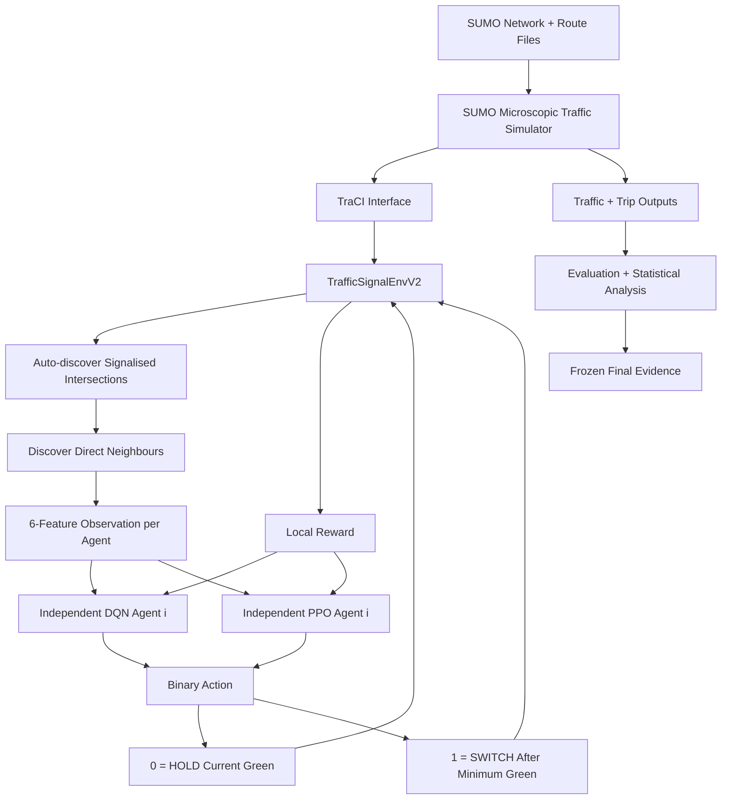

# Scalable Multi-Agent Reinforcement Learning for Adaptive Traffic Signal Control

A simulation-based **Multi-Agent Reinforcement Learning (MARL)** framework for adaptive urban traffic-signal control using **Python, SUMO, TraCI, Deep Q-Networks (DQN), and Proximal Policy Optimisation (PPO)**.

This repository contains the implementation, simulation networks, calibrated traffic-demand files, trained models, evaluation outputs, statistical-analysis artefacts, computational-scaling measurements, and reproducibility material developed for the Master's thesis:

> **Scalable Multi-Agent Reinforcement Learning for Adaptive Traffic Signal Control in Urban Environments**

**Author:** Venushambhu Hullukatte Nataraju  
**Degree:** M.Sc. Data Science  
**Institution:** University of Europe for Applied Sciences, Potsdam  
**Year:** 2026

---

## Final Thesis and IEEE-Style Paper

- [Master's Thesis](docs/Master_Thesis_Venushambhu.pdf)
- [IEEE-Style Research Paper](docs/IEEE_Paper_MARL_Traffic_Signal_Control.pdf)

The repository should be interpreted together with these final documents. Earlier development outputs may remain in the Git history, but the **final thesis evidence is the corrected V2 experiment described below**.

---

## Project Overview

Urban traffic-signal control is a networked sequential decision problem: a phase decision at one intersection changes immediate discharge, residual queues, downstream arrivals, and the future state observed by neighbouring intersections.

This project evaluates a deliberately simple **independent-agent MARL architecture** in which each signalised intersection owns its own DQN or PPO model. The final study does **not** introduce a new RL algorithm. Instead, it focuses on whether a reproducible independent-agent architecture can:

1. operate across multiple network sizes without hard-coded intersection definitions;
2. adapt to different traffic-demand regimes;
3. remain competitive with strong conventional traffic-signal controllers;
4. preserve traffic performance as the number of controlled intersections increases; and
5. remain computationally practical within the tested 4–25-agent range.

A central finding of the final study is that **baseline strength materially changes the interpretation of MARL performance**. Large gains against a weak static controller do not automatically imply superiority over a strong demand-responsive controller.

---

## Final Experimental Design

The final deterministic evaluation contains **175 unique runs** across **five controllers**:

1. **Original Fixed-Time**
2. **Webster-derived Fixed-Time**
3. **Actuated**
4. **Independent DQN**
5. **Independent PPO**

### 2×2 demand-sensitivity experiment

Four traffic-demand scenarios are evaluated:

- Low
- Medium
- High / severe oversaturation stress test
- Dynamic

For each scenario:

```text
5 controllers
× 5 matched evaluation seeds
= 25 runs
```

Across the four scenarios:

```text
4 scenarios
× 5 controllers
× 5 seeds
= 100 runs
```

### Medium-demand scalability experiment

The same controller set is evaluated on:

| Grid | Controlled intersections / agents | Planned vehicles |
|---|---:|---:|
| 2×2 | 4 | 1,500 |
| 3×3 | 9 | 1,800 |
| 4×4 | 16 | 2,000 |
| 5×5 | 25 | 1,566 |

The 2×2 medium-demand results are already part of the 100-run demand experiment. The three larger grids add:

```text
3 additional grids
× 5 controllers
× 5 seeds
= 75 additional runs
```

Therefore:

```text
100 demand-study runs
+ 75 additional scalability runs
= 175 unique final evaluation runs
```

**Evaluation seeds:** `11, 12, 13, 14, 15`

**Training seed:** `1`

**Training budget:** `50,000 decision steps` per learned-controller training job

---

## Why the Final Experiment Uses Stronger Baselines

The original development experiment compared learned controllers primarily with a simple fixed-time programme. That comparison was retained for continuity, but it was not considered sufficiently strong for the final thesis conclusions.

The final evaluation therefore uses three conventional references:

### Original Fixed-Time

A simple fixed programme retained from the initial experiment.

### Webster-derived Fixed-Time

A stronger demand-informed fixed-time controller generated using Webster-style timing principles.

### Actuated

A non-learning adaptive controller that changes signal timing in response to detected traffic conditions.

The final conclusions are based primarily on comparison with the **stronger Webster and Actuated controllers**, not only with Original Fixed-Time.

---

## Network Scalability

The final architecture is instantiated on synthetic SUMO grids containing:

| Grid | Agents |
|---|---:|
| 2×2 | 4 |
| 3×3 | 9 |
| 4×4 | 16 |
| 5×5 | 25 |

The environment discovers signalised intersections and their direct neighbours from the SUMO topology. The per-agent observation and action interfaces remain fixed as network size increases.

The thesis separates three different meanings of scalability:

### Architectural scalability

Can the same software architecture instantiate more agents without redesigning the per-agent interface?

### Behavioural scalability

Does traffic performance remain competitive as the number of controlled intersections increases?

### Computational scalability

How do training runtime, memory, model storage, replay/rollout-buffer overhead, and decision latency change as the number of agents increases?

The project demonstrates these properties only within the **tested synthetic 4–25-agent range**. It does not claim unbounded, city-scale, or field-deployment scalability.

---

## System Architecture



Each signalised intersection is represented by an independent reinforcement-learning agent.

The final implementation uses:

- no shared critic;
- no parameter sharing;
- no explicit agent-to-agent messaging;
- one independent DQN or PPO model per controlled intersection;
- a fixed six-feature local / one-hop observation; and
- a fixed binary HOLD/SWITCH action interface.

---

## Final Agent Observation

Every agent receives the same **six-element observation vector** regardless of total network size:

1. local halted-vehicle count;
2. accumulated local lane waiting time;
3. mean lane occupancy;
4. encoded current traffic-signal phase;
5. elapsed time in the current green phase; and
6. mean queue condition of directly connected traffic-light neighbours.

Queue, waiting-time, and timing features are scaled before being passed to the learning model.

Because the observation dimension stays fixed, increasing network size increases the **number of independent agents**, not the dimensionality of each agent's input.

---

## Corrected Action Space

The final V2 environment uses a discrete binary action space:

| Action | Meaning |
|---|---|
| `0` | **HOLD** the current green |
| `1` | Request **SWITCH** to the opposite green after the minimum-green constraint |

Timing constraints:

| Parameter | Final value |
|---|---:|
| Decision interval | 5 s |
| Minimum green | 10 s |
| Yellow transition | 3 s |
| Dedicated all-red | 0 s |

### Important V2 correction

`HOLD` genuinely holds the active green. It does **not** allow an underlying fixed programme to advance automatically.

A permitted `SWITCH` initiates the required yellow transition and then activates the opposite green.

All final learned-controller models were retrained under these corrected semantics. Earlier learned models from the pre-V2 control semantics are not used as final thesis evidence.

---

## Reward Function

For agent \(i\) at decision time \(t\), the local reward is:

```text
r_i,t = -α ΔW_i,t - β Q_i,t + δ T_i,t - λ C_i,t
```

where:

- `ΔW` = change in accumulated local waiting time;
- `Q` = local halted-vehicle queue;
- `T` = local discharge measure;
- `C` = permitted agent-requested switching cost.

Final weights:

```text
α = 0.3
β = 0.2
δ = 0.1
λ = 0.5
```

The reward is used to train the learned controllers, but **final controller quality is evaluated using external traffic-performance metrics rather than cumulative reward alone**.

---

## Reinforcement-Learning Algorithms

### Independent DQN

Each signalised intersection owns an independent DQN model.

Final configuration:

| Hyperparameter | Value |
|---|---:|
| Learning rate | `1e-3` |
| Discount factor γ | `0.95` |
| Replay-buffer capacity | `50,000` |
| Batch size | `64` |
| Learning starts | `500` decision steps |
| Gradient update | Every `4` decision steps |
| Initial ε | `1.0` |
| Final ε | `0.05` |
| Exploration decay | First `70%` of training |
| Target-network update | Every `250` decision steps |
| Training budget | `50,000` decision steps |
| Training seed | `1` |

### Independent PPO

Each signalised intersection owns an independent PPO policy/value model.

Final configuration:

| Hyperparameter | Value |
|---|---:|
| Learning rate | `3e-4` |
| Discount factor γ | `0.95` |
| Rollout length | `128` |
| Batch size | `32` |
| Optimisation epochs | `4` |
| GAE λ | `0.9` |
| PPO clip range | `0.2` |
| Entropy coefficient | `0.01` |
| Training budget | `50,000` decision steps |
| Training seed | `1` |

---

## Traffic-Demand Scenarios

### Low demand

Represents sparse traffic where signal timing has limited opportunity to improve already-light traffic conditions.

Planned vehicles:

```text
600
```

### Medium demand

Represents the main operational comparison regime.

Planned vehicles on 2×2:

```text
1,500
```

### High-demand stress test

A deliberately severe oversaturated condition used to examine controller failure behaviour.

Planned vehicles:

```text
3,000
```

This condition should **not** be interpreted as ordinary medium congestion.

### Dynamic demand

Contains two temporal demand regimes within the same 1,800-second episode.

Planned vehicles:

```text
1,200
```

The learned models are trained on the same route structure and evaluated with different SUMO seeds. The dynamic experiment therefore tests adaptation to changing traffic within a trained scenario class; it is **not** presented as out-of-distribution generalisation.

---

## Cross-Network Demand Calibration

The larger-network experiment intentionally does **not** scale vehicle count directly in proportion to the number of intersections.

Increasing network size changes:

- total road length;
- route-length distribution;
- available paths;
- congestion formation; and
- network storage capacity.

Direct proportional scaling produced severe gridlock during calibration and would have confounded network-size effects with uncontrolled demand severity.

The final medium-demand route sets were therefore calibrated independently.

| Grid | Planned vehicles |
|---|---:|
| 2×2 | 1,500 |
| 3×3 | 1,800 |
| 4×4 | 2,000 |
| 5×5 | 1,566 |

Under the Webster-derived fixed-time reference, mean waiting time remains approximately **15–16 seconds** across the four final medium-demand networks.

Because the route sets are calibrated separately, raw queue values should not be interpreted as proof that one grid size is intrinsically easier than another. The final thesis compares controller performance **within each calibrated network**.

---

## Final Evaluation Metrics

The primary operational metrics are:

- **Trip completion rate**
- **Average travel time**
- **Average waiting time**
- **Average time loss**
- **Mean sampled queue length**

Additional diagnostic information includes:

- teleport count;
- arrivals and departures;
- step-level traffic state;
- SUMO trip information;
- training reward;
- model/resource measurements.

Training reward is treated only as a **learning diagnostic**, not as the final traffic-performance measure.

---

## Statistical Evaluation

All final controller comparisons use matched SUMO evaluation seeds:

```text
11, 12, 13, 14, 15
```

Seven predefined paired comparisons are used within each scenario–metric or grid–metric family:

```text
DQN vs Original Fixed
DQN vs Webster
DQN vs Actuated
PPO vs Original Fixed
PPO vs Webster
PPO vs Actuated
DQN vs PPO
```

For each paired comparison, the final analysis reports:

- paired mean difference;
- paired t-test;
- **Holm-Bonferroni family-wise multiplicity correction**;
- 95% confidence interval;
- paired-samples Cohen's `d_z`;
- median paired difference; and
- exact two-sided paired sign-flip sensitivity check.

The sign-flip test is retained as a sensitivity analysis because with only five matched pairs its minimum attainable exact two-sided p-value is `0.0625`.

The final conclusions therefore emphasise:

- effect direction;
- effect magnitude;
- confidence intervals;
- Holm-adjusted p-values; and
- consistency across matched seeds.

---

# Final Results

## 2×2 Demand-Sensitivity Results

Five-seed means:

| Scenario | Controller | Completion (%) | Travel (s) | Waiting (s) | Time loss (s) | Queue |
|---|---|---:|---:|---:|---:|---:|
| Low | Original Fixed | 94.93 | 97.43 | 19.57 | 33.80 | 1.627 |
| Low | Webster | 95.03 | 83.73 | 6.32 | 20.05 | 0.468 |
| Low | Actuated | **95.37** | **81.59** | **4.81** | **17.88** | **0.356** |
| Low | DQN | 95.17 | 83.15 | 6.11 | 19.43 | 0.383 |
| Low | PPO | 95.07 | 83.07 | 5.97 | 19.34 | 0.377 |
| Medium | Original Fixed | 92.95 | 122.23 | 36.24 | 59.56 | 6.513 |
| Medium | Webster | 94.27 | 98.89 | 15.13 | 36.28 | 2.315 |
| Medium | Actuated | **94.43** | **96.62** | **14.85** | **33.95** | **2.128** |
| Medium | DQN | 94.13 | 98.48 | 15.49 | 35.85 | 2.192 |
| Medium | PPO | 94.12 | 100.96 | 17.07 | 38.34 | 2.511 |
| High | Original Fixed | 13.44 | 273.54 | 162.00 | 200.89 | 74.092 |
| High | Webster | **15.53** | **258.63** | **134.48** | **187.96** | **70.123** |
| High | Actuated | 13.17 | 288.17 | 177.36 | 215.33 | 73.682 |
| High | DQN | 14.55 | 261.99 | 139.49 | 189.10 | 72.385 |
| High | PPO | 7.45 | 358.44 | 233.98 | 259.01 | 74.152 |
| Dynamic | Original Fixed | 93.02 | 116.10 | 28.95 | 50.18 | 4.334 |
| Dynamic | Webster | 93.95 | 102.84 | 14.54 | 36.87 | 2.005 |
| Dynamic | Actuated | **94.40** | **94.47** | **10.69** | **28.49** | **1.361** |
| Dynamic | DQN | 93.97 | 97.19 | 12.36 | 31.22 | 1.597 |
| Dynamic | PPO | 93.28 | 104.20 | 16.09 | 38.28 | 2.149 |

### Main demand-study findings

- **Low demand:** all controllers complete roughly 95% of trips; Actuated has the strongest descriptive efficiency.
- **Medium demand:** DQN is statistically competitive with Actuated across the five primary metrics after Holm-Bonferroni correction.
- **High demand:** the network enters a severe oversaturated breakdown regime; Webster is strongest descriptively, DQN remains relatively robust, and PPO deteriorates substantially.
- **Dynamic demand:** DQN improves strongly over Original Fixed-Time and Webster on several delay metrics, but Actuated remains the strongest controller.

Across the complete 2×2 demand statistical analysis:

```text
81 / 140 Holm-adjusted paired comparisons were significant
```

This number is not treated as a controller-quality score; it only summarises detectable separation across the predefined comparison families.

---

## Medium-Demand Scalability Results

Five-seed means:

| Grid | Agents | Controller | Completion (%) | Travel (s) | Waiting (s) | Time loss (s) | Queue |
|---|---:|---|---:|---:|---:|---:|---:|
| 2×2 | 4 | Original Fixed | 92.95 | 122.23 | 36.24 | 59.56 | 6.513 |
| 2×2 | 4 | Webster | 94.27 | 98.89 | 15.13 | 36.28 | 2.315 |
| 2×2 | 4 | Actuated | **94.43** | **96.62** | **14.85** | **33.95** | **2.128** |
| 2×2 | 4 | DQN | 94.13 | 98.48 | 15.49 | 35.85 | 2.192 |
| 2×2 | 4 | PPO | 94.12 | 100.96 | 17.07 | 38.34 | 2.511 |
| 3×3 | 9 | Original Fixed | 91.69 | 135.94 | 40.06 | 63.84 | 4.086 |
| 3×3 | 9 | Webster | 93.58 | 111.52 | 16.10 | 39.33 | 1.507 |
| 3×3 | 9 | Actuated | **93.73** | **107.20** | **14.28** | **35.01** | **1.324** |
| 3×3 | 9 | DQN | 93.49 | 110.99 | 16.48 | 38.80 | 1.444 |
| 3×3 | 9 | PPO | 93.28 | 115.63 | 19.68 | 43.45 | 1.753 |
| 4×4 | 16 | Original Fixed | 91.57 | 144.55 | 40.10 | 62.54 | 2.650 |
| 4×4 | 16 | Webster | 92.98 | 121.26 | 15.02 | 39.13 | 0.909 |
| 4×4 | 16 | Actuated | **93.12** | **116.34** | **12.85** | **34.22** | **0.767** |
| 4×4 | 16 | DQN | 92.95 | 120.53 | 15.73 | 38.41 | 0.862 |
| 4×4 | 16 | PPO | 92.47 | 124.13 | 18.28 | 42.05 | 1.033 |
| 5×5 | 25 | Original Fixed | 91.26 | 156.21 | 43.14 | 64.89 | 1.484 |
| 5×5 | 25 | Webster | 92.36 | 132.23 | 15.18 | 40.87 | 0.484 |
| 5×5 | 25 | Actuated | **92.81** | **125.43** | **12.07** | **34.00** | **0.385** |
| 5×5 | 25 | DQN | 92.57 | 129.50 | 15.20 | 38.10 | 0.417 |
| 5×5 | 25 | PPO | 92.48 | 131.49 | 16.64 | 40.11 | 0.469 |

### Main behavioural-scalability findings

**Actuated is the strongest descriptive controller under calibrated medium demand at every tested grid size.**

For DQN:

- completion remains statistically similar to Actuated at 4, 9, 16, and 25 agents;
- at 4 agents, DQN is statistically indistinguishable from Actuated on all five primary metrics;
- from 9 agents onward, DQN develops statistically significant disadvantages in travel time, waiting time, and queue length;
- the 25-agent DQN queue difference is statistically borderline and small in magnitude.

For PPO:

- PPO is generally weaker than DQN on delay and queue metrics;
- significant disadvantages relative to Actuated appear earlier and are larger;
- PPO is particularly weak under the severe high-demand stress test.

Across the complete medium-demand scalability statistical analysis:

```text
101 / 140 Holm-adjusted paired comparisons were significant
```

The final behavioural conclusion is therefore **not** that MARL performance improves with scale. Instead:

> Independent DQN preserves completion-rate performance comparatively well, but does not preserve equality with the strong Actuated controller on congestion-efficiency metrics beyond the 2×2 network.

---

## Computational Scalability

Measured final V2 results:

| Method | Agents | Training time (s) | Simulation wall time (s) | RAM (MB) | Buffer (MB) | Model size (MB) | Mean latency (ms) |
|---|---:|---:|---:|---:|---:|---:|---:|
| DQN | 4 | 357.24 | 2.02 | 343.30 | 12.970 | 0.369 | 0.1978 |
| DQN | 9 | 692.93 | 3.96 | 357.94 | 29.182 | 0.829 | 0.3926 |
| DQN | 16 | 1046.14 | 6.84 | 388.56 | 51.880 | 1.475 | 0.6537 |
| DQN | 25 | 1398.06 | 10.63 | 422.66 | 81.062 | 2.304 | 1.0388 |
| PPO | 4 | 388.05 | 2.01 | 335.06 | 0.027 | 0.531 | 0.2827 |
| PPO | 9 | 731.54 | 4.05 | 334.73 | 0.062 | 1.195 | 0.5995 |
| PPO | 16 | 1018.70 | 6.95 | 339.75 | 0.109 | 2.125 | 0.9859 |
| PPO | 25 | 1469.70 | 10.79 | 343.27 | 0.171 | 3.320 | 1.5655 |

At 25 agents:

```text
DQN mean joint latency = 1.0388 ms
PPO mean joint latency = 1.5655 ms
```

Relative to the 5,000-ms decision interval:

```text
DQN ≈ 0.0208% of decision budget
PPO ≈ 0.0313% of decision budget
```

The measured 95th-percentile joint decision latencies at 25 agents were approximately:

```text
DQN = 1.1955 ms
PPO = 1.8251 ms
```

### Computational interpretation

- training runtime increases with agent count for both algorithms;
- total saved model storage increases because each intersection owns an independent model;
- DQN replay-buffer memory grows substantially with agent count;
- PPO rollout-buffer memory remains much smaller;
- deterministic inference remains extremely small relative to the 5-second control interval throughout the tested range.

**CPU/GPU utilisation percentages were not instrumented during the frozen final runs and are not reconstructed retrospectively.**

The computational conclusions therefore rely only on measurements that were actually captured.

---

## Final Conclusions

The final experiment supports the following conclusions:

- Stronger conventional baselines materially change the apparent advantage of MARL.
- Original Fixed-Time is a useful weak reference but is insufficient as the sole baseline.
- Actuated control is the strongest descriptive medium-demand controller across all tested grid sizes.
- DQN is the strongest learned controller in the final study.
- On the 2×2 medium-demand network, DQN is statistically competitive with Actuated across the five primary traffic metrics.
- From 3×3 onward, DQN preserves a similar completion rate but develops significant delay and queue disadvantages relative to Actuated.
- PPO scales less favourably and deteriorates strongly in the severe high-demand stress test.
- The architecture successfully instantiates 4, 9, 16, and 25 independent agents without network-specific hard-coded control logic.
- Deterministic inference remains computationally lightweight throughout the tested 4–25-agent range.
- Training time, model storage, and DQN replay-buffer memory grow with agent count.
- The evidence does **not** support universal MARL superiority over strong conventional adaptive traffic control.
- The study does **not** claim city-scale, unbounded, or field-deployment scalability.

---

## Final V2 Evidence and Reproducibility

The final thesis revision keeps corrected V2 experiments separate from earlier development outputs.

Important final locations include:

```text
revision_v2/
results_v2/
models_v2/
baselines_v2/
docs/
```

The authoritative final-results manifest is:

```text
results_v2/FINAL_RESULTS_MANIFEST.txt
```

Final thesis-ready derived figures/tables are retained under:

```text
results_v2/thesis_package/
```

The final evidence package includes:

- SUMO network and route files;
- final DQN and PPO models;
- training logs;
- step-level evaluation outputs;
- SUMO trip information;
- conventional-controller summaries;
- learned-controller summaries;
- paired statistical test outputs;
- computational-resource summaries;
- final figures and tables; and
- checksum-based evidence verification.

The final numerical evidence was frozen before thesis reporting so that tables and conclusions were generated from retained outputs rather than manually edited values.

---

## Repository Structure

The repository contains both earlier development work and the corrected final V2 revision.

A simplified view is:

```text
.
├── README.md
├── docs/
│   ├── Master_Thesis_Venushambhu.pdf
│   └── IEEE_Paper_MARL_Traffic_Signal_Control.pdf
│
├── env/
│   ├── traffic_env.py
│   ├── train_dqn_marl.py
│   ├── train_ppo_marl.py
│   ├── collect_baseline.py
│   ├── evaluate_trained.py
│   ├── run_grid_evaluations.py
│   ├── analyze_results.py
│   ├── analyze_scalability.py
│   └── ...
│
├── revision_v2/
│   └── corrected final V2 environment / experiment workflow
│
├── network/
│   ├── grid2x2/
│   ├── grid3x3/
│   ├── grid4x4/
│   └── grid5x5/
│
├── routes/
│   ├── grid2x2/
│   ├── grid3x3/
│   ├── grid4x4/
│   └── grid5x5/
│
├── models/
├── models_v2/
├── baselines_v2/
│
├── results/
├── results_v2/
│   ├── analysis/
│   ├── thesis_package/
│   └── FINAL_RESULTS_MANIFEST.txt
│
└── test/
```

> **Important:** directories without the `_v2` suffix may contain earlier development artefacts. The final thesis conclusions are based on the corrected V2 evidence.

---

## Software Environment

The project was developed and evaluated using the following environment:

| Software | Version |
|---|---|
| Python | `3.11.15` |
| Eclipse SUMO | `1.27.1` |
| Stable-Baselines3 | `2.9.0` |
| PyTorch | `2.13.0` |
| NumPy | `2.4.6` |
| Gymnasium | `1.3.0` |
| pandas | `3.0.5` |
| SciPy | `1.17.1` |

Matplotlib is used for analysis visualisation.

---

## Installation

### 1. Clone the repository

```bash
git clone https://github.com/Venushambhu/Scalable-MARL-for-adaptive-traffic-signal-control-.git

cd Scalable-MARL-for-adaptive-traffic-signal-control-
```

### 2. Create a Python environment

Using Conda:

```bash
conda create -n thesis python=3.11
conda activate thesis
```

Install the required Python libraries:

```bash
pip install stable-baselines3 gymnasium torch numpy pandas scipy matplotlib
```

For exact reproduction, use versions matching the verified environment above.

### 3. Install SUMO

Confirm SUMO is available:

```bash
sumo --version
```

The final experiments used:

```text
SUMO 1.27.1
```

If required, configure `SUMO_HOME`:

```bash
export SUMO_HOME="/path/to/sumo"
```

Then verify the Python interfaces:

```bash
python -c "import traci, sumolib; print('TraCI and sumolib available')"
```

---

## Running the Repository

This repository contains both the earlier development workflow and the corrected final V2 experiment.

### Earlier development scripts

The original `env/` scripts remain useful for understanding the project structure and development process.

Examples include:

```text
env/train_dqn_marl.py
env/train_ppo_marl.py
env/collect_baseline.py
env/evaluate_trained.py
env/analyze_results.py
env/analyze_scalability.py
```

These scripts should **not** be assumed to reproduce the final 175-run thesis evidence unless they explicitly use the V2 environment and final baseline definitions.

### Final V2 workflow

Use the scripts/configurations under:

```text
revision_v2/
```

for the corrected HOLD/SWITCH environment and final experiment workflow.

Before running any script, inspect its supported arguments:

```bash
python <script_name>.py --help
```

The retained `results_v2/`, `models_v2/`, and `baselines_v2/` directories provide the final thesis evidence and should be used when validating the published thesis results.

---

## Output Types

The project retains multiple levels of evidence.

### Step-level traffic outputs

Contain time-dependent controller and traffic information such as:

- simulation time;
- intersection identifier;
- queue state;
- waiting state;
- vehicle state;
- signal state;
- departures;
- arrivals;
- teleport diagnostics.

### SUMO trip information

Vehicle-level trip outputs provide:

- completed trips;
- travel time;
- waiting time;
- time loss;
- route/trip information.

### Run summaries

Per-run summaries retain:

- controller;
- grid;
- demand scenario;
- seed;
- planned/completed trips;
- completion rate;
- average travel time;
- average waiting time;
- average time loss;
- sampled queue statistics;
- simulation diagnostics.

### Statistical outputs

Final analysis retains:

- descriptive summaries;
- matched paired comparisons;
- Holm-adjusted p-values;
- confidence intervals;
- effect sizes;
- sign-flip sensitivity checks.

### Computational outputs

Final profiling retains:

- training runtime;
- simulation/evaluation wall time;
- process-tree RAM;
- replay/rollout-buffer overhead;
- total saved model size;
- mean joint decision latency;
- 95th-percentile joint decision latency.

---

## Validation

The final V2 environment was regression-tested before the learned models were retrained.

The validation checks included:

- Action `0` genuinely holds the active green;
- Action `1` obeys the minimum-green constraint;
- yellow transition duration is exactly 3 seconds;
- reset returns signals to the expected state;
- route and network structures are internally consistent;
- final result inputs are checksum-verified.

No final results are based on the obsolete learned models trained before the action-semantics correction.

---

## Research Limitations

The final conclusions are intentionally bounded.

### Synthetic networks

The experiments use synthetic regular SUMO grids rather than calibrated real-city networks.

### Network heterogeneity

Larger grids do not reproduce the full geometric, traffic, sensing, and operational heterogeneity of real urban networks.

### Scalability range

The largest tested network contains **25 controlled intersections**.

The study therefore demonstrates only tested-range scalability, not city-scale deployment.

### Demand at scale

The 3×3, 4×4, and 5×5 scalability experiments are evaluated under calibrated medium demand only.

Low, high, and dynamic demand are not crossed with every larger grid size.

### Training variability

Each learned configuration uses one training seed.

The study therefore does not quantify variability across multiple neural-network initialisations.

### Evaluation sample size

Five matched evaluation seeds provide repeated observations but remain a small inferential sample.

### Independent learning

Agents do not use:

- parameter sharing;
- a centralised critic; or
- explicit inter-agent messaging.

This simplicity supports architectural scalability but may limit coordination as the network grows.

### CPU/GPU utilisation

CPU/GPU utilisation percentages were not instrumented during the final runs and are not reconstructed retrospectively.

### Simulation-to-real gap

Real deployments would additionally involve:

- noisy detectors;
- incidents;
- pedestrians;
- public transport;
- emergency vehicles;
- heterogeneous driver behaviour;
- communication delays;
- controller hardware;
- redundancy and monitoring;
- safety certification; and
- field validation.

The project does not claim deployment readiness.

---

## Academic Context

This repository accompanies the Master's thesis:

**Venushambhu Hullukatte Nataraju.**  
*Scalable Multi-Agent Reinforcement Learning for Adaptive Traffic Signal Control in Urban Environments.*  
M.Sc. Data Science, University of Europe for Applied Sciences, Potsdam, 2026.

The repository also contains a concise IEEE-style paper derived from the final experiment.

---

## Citation

If you use this project in academic work, please cite:

```bibtex
@mastersthesis{nataraju2026scalablemarl,
  author  = {Venushambhu Hullukatte Nataraju},
  title   = {Scalable Multi-Agent Reinforcement Learning for Adaptive Traffic Signal Control in Urban Environments},
  school  = {University of Europe for Applied Sciences},
  year    = {2026},
  address = {Potsdam, Germany},
  url     = {https://github.com/Venushambhu/Scalable-MARL-for-adaptive-traffic-signal-control-}
}
```

---

## Repository

GitHub:

**[Venushambhu/Scalable-MARL-for-adaptive-traffic-signal-control-](https://github.com/Venushambhu/Scalable-MARL-for-adaptive-traffic-signal-control-)**

---

## License

No explicit open-source licence is currently included in this repository.

Unless a licence is added, reuse and redistribution should not be assumed to be permitted. Please contact the repository author regarding reuse.

---

## Author

**Venushambhu Hullukatte Nataraju**  
M.Sc. Data Science  
University of Europe for Applied Sciences  

GitHub: [@Venushambhu](https://github.com/Venushambhu)
