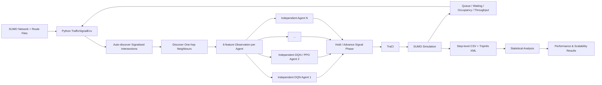
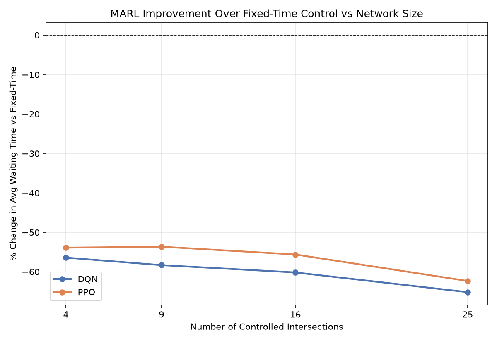
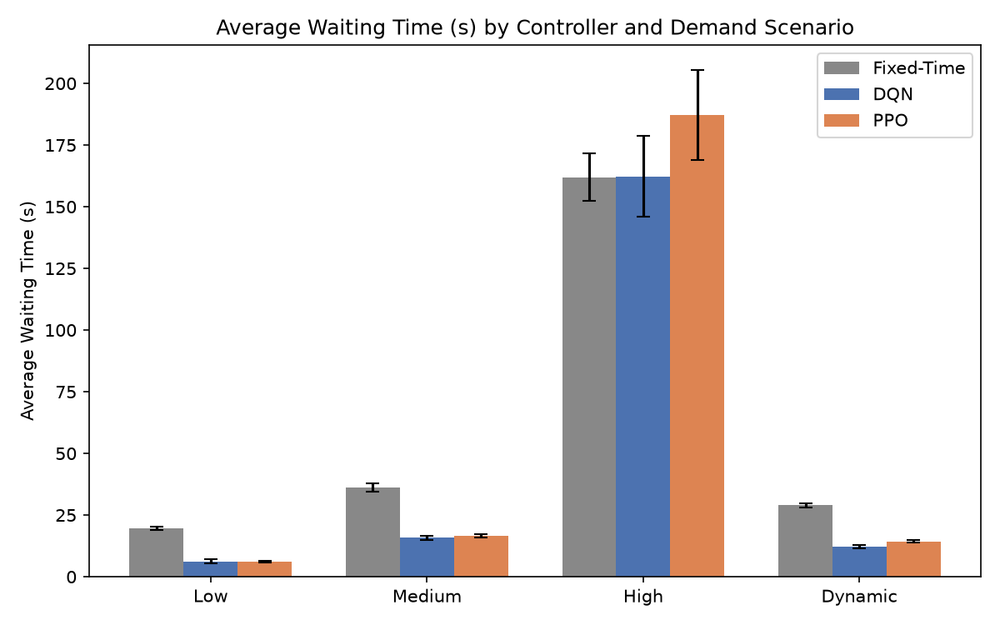

# Scalable Multi-Agent Reinforcement Learning for Adaptive Traffic Signal Control

A simulation-based **Multi-Agent Reinforcement Learning (MARL)** framework for adaptive urban traffic signal control using **Python, SUMO, TraCI, Deep Q-Networks (DQN), and Proximal Policy Optimisation (PPO)**.

This repository contains the complete implementation, trained models, simulation networks, traffic-demand files, evaluation outputs, statistical analysis scripts, and scalability experiments developed for the Master's thesis:

> **Scalable Multi-Agent Reinforcement Learning for Adaptive Traffic Signal Control in Urban Environments**

**Author:** Venushambhu Hullukatte Nataraju
**Degree:** M.Sc. Data Science
**Institution:** University of Europe for Applied Sciences, Potsdam
**Year:** 2026

---

## Overview

Conventional fixed-time traffic signals use predefined phase schedules and cannot directly adapt to rapidly changing traffic conditions. This project investigates whether **independent reinforcement-learning agents**, with one agent controlling each signalised intersection, can improve traffic performance while remaining usable as the road network grows.

The framework was designed around two main questions:

1. Can independent DQN and PPO agents outperform a conventional fixed-time controller under different traffic-demand conditions?
2. Can the same MARL implementation scale from a small 2×2 traffic grid to larger networks without hard-coded intersection definitions?

The project evaluates:

* **Fixed-Time Control** — conventional baseline
* **Independent DQN**
* **Independent PPO**

across synthetic SUMO road networks containing:

| Grid | Controlled Intersections / Agents |
| ---- | --------------------------------: |
| 2×2  |                                 4 |
| 3×3  |                                 9 |
| 4×4  |                                16 |
| 5×5  |                                25 |

The same environment automatically discovers the signalised intersections and their direct neighbours from the SUMO network file.

---

## Key Features

* Fully integrated **Python + SUMO + TraCI** simulation pipeline
* True **independent multi-agent learning**
* One DQN or PPO model per signalised intersection
* No shared neural-network parameters between agents
* No explicit inter-agent communication
* Automatic discovery of traffic lights and neighbouring intersections
* Fixed-size local observation representation independent of total network size
* DQN and PPO implementations using Stable-Baselines3 components
* Low, medium, high and dynamic traffic-demand scenarios
* Fixed-time baseline using identical traffic networks and SUMO seeds
* Step-level traffic logging
* SUMO `tripinfo` outputs
* Training logs and saved model checkpoints
* Matched-seed statistical evaluation
* Paired t-tests and Wilcoxon signed-rank tests
* 95% Student-t confidence intervals
* Paired-samples Cohen's (d_z)
* Dedicated 2×2 → 5×5 scalability experiment
* Raw results retained, including unfavourable MARL outcomes

---

## System Architecture



Each traffic-light-controlled intersection is represented by an independent reinforcement-learning agent.

The number of models therefore increases with the number of signalised intersections:

* 4 agents → 2×2
* 9 agents → 3×3
* 16 agents → 4×4
* 25 agents → 5×5

The environment code itself does not need to be rewritten when the network size changes.

---

## Agent State Representation

Each agent receives a **6-dimensional observation vector** containing local and neighbouring traffic information:

1. Local queue length
2. Local accumulated waiting time
3. Mean lane occupancy
4. Current traffic-signal phase
5. Time since the previous phase change
6. Mean queue pressure at directly neighbouring signalised intersections

The features are normalised before being supplied to the learning algorithm.

This provides each agent with local traffic information while incorporating limited spatial context without exposing the entire network state.

---

## Action Space

Each intersection uses a discrete binary action space:

| Action | Meaning                         |
| ------ | ------------------------------- |
| `0`    | Hold the current signal phase   |
| `1`    | Advance to the next legal phase |

A **minimum green time of 10 seconds** is enforced to prevent unrealistic rapid switching.

The controller makes a decision every **5 simulation seconds**.

---

## Reward Function

For agent (i) at time (t), the implemented reward is:

[
r_{i,t}
=======

-\alpha \Delta W_{i,t}
-\beta Q_{i,t}
+\delta T_{i,t}
-\lambda C_{i,t}
]

where:

* (\Delta W) = change in local waiting time
* (Q) = current queue length
* (T) = vehicles discharged from the controlled approaches
* (C) = phase-switch penalty

The final weights are:

```text
α = 0.3
β = 0.2
δ = 0.1
λ = 0.5
```

The reward therefore encourages queue dissipation and vehicle discharge while discouraging unnecessary switching.

---

## Reinforcement-Learning Algorithms

### Deep Q-Network — DQN

Each signalised intersection owns an independent DQN model.

Final training configuration:

| Hyperparameter        |                   Value |
| --------------------- | ----------------------: |
| Learning rate         |                  `1e-3` |
| Discount factor       |                  `0.95` |
| Replay buffer         |                `50,000` |
| Batch size            |                    `64` |
| Learning starts       |             `500` steps |
| Exploration           |                ε-greedy |
| Initial ε             |                   `1.0` |
| Final ε               |                  `0.05` |
| Exploration decay     |   First 70% of training |
| Target-network update |         Every 250 steps |
| Training budget       | `50,000` decision steps |

A separate target Q-network is maintained and updated using Polyak updates.

---

### Proximal Policy Optimisation — PPO

Each intersection similarly owns an independent PPO actor-critic model.

Final configuration:

| Hyperparameter      |                   Value |
| ------------------- | ----------------------: |
| Learning rate       |                  `3e-4` |
| Discount factor     |                  `0.95` |
| Rollout length      |                   `128` |
| Batch size          |                    `32` |
| Epochs per update   |                     `4` |
| GAE λ               |                   `0.9` |
| PPO clipping range  |                   `0.2` |
| Entropy coefficient |                  `0.01` |
| Training budget     | `50,000` decision steps |

Because Stable-Baselines3 is primarily designed around single-agent environments, separate models and rollout buffers are maintained for each traffic-signal agent.

---

## Traffic Scenarios

The primary 2×2 experiment evaluates four traffic conditions.

### Low Demand

Represents uncongested traffic where the network operates well below capacity.

### Medium Demand

Represents moderate congestion where traffic-signal decisions can substantially influence queue formation and dissipation.

### High Demand

Represents heavily saturated traffic approaching the physical capacity of the simulated network.

### Dynamic Demand

Represents temporally changing traffic.

The dominant demand direction changes during the simulation, testing whether the trained controllers can respond to a changing traffic pattern within an episode.

> The dynamic experiment evaluates adaptation within a demand structure encountered during training; it should not be interpreted as out-of-distribution generalisation.

For the larger 3×3, 4×4 and 5×5 scalability networks, the repository contains the **calibrated medium-demand scenario** used in the final scalability study.

---

## Experimental Design

### Primary Experiment — 2×2

```text
3 controllers
× 4 demand scenarios
× 5 evaluation seeds
= 60 evaluation runs
```

Controllers:

* Fixed-Time
* DQN
* PPO

Scenarios:

* Low
* Medium
* High
* Dynamic

Evaluation seeds:

```text
11, 12, 13, 14, 15
```

---

### Scalability Experiment

The medium-demand experiment was extended across:

```text
2×2 → 4 agents
3×3 → 9 agents
4×4 → 16 agents
5×5 → 25 agents
```

For each size:

```text
3 controllers × 5 seeds = 15 runs
```

The 15 medium-demand 2×2 runs are shared with the primary experiment.

Therefore:

```text
60 primary runs
+ 45 additional larger-network runs
= 105 unique final evaluation runs
```

---

## Evaluation Metrics

The principal operational metrics are:

* **Average travel time**
* **Average waiting time**
* **Queue length**
* **Completed trips / throughput**
* **Trip completion rate**
* **Cumulative training reward**

Additional raw simulation information is retained in the step-level logs and SUMO `tripinfo` files.

Training reward is treated as an optimisation diagnostic rather than as evidence of traffic performance by itself.

---

## Main Results

### 2×2 Demand-Sensitivity Experiment

Under **low, medium and dynamic demand**, both learned controllers substantially reduced travel time and waiting time relative to fixed-time control.

| Scenario | DQN Waiting-Time Reduction | PPO Waiting-Time Reduction | DQN Travel-Time Reduction | PPO Travel-Time Reduction |
| -------- | -------------------------: | -------------------------: | ------------------------: | ------------------------: |
| Low      |                  **68.1%** |                  **69.1%** |                 **14.4%** |                 **14.7%** |
| Medium   |                  **56.4%** |                  **53.9%** |                 **19.0%** |                 **17.9%** |
| Dynamic  |                  **57.6%** |                  **50.5%** |                 **16.3%** |                 **13.2%** |

Most delay improvements were highly statistically significant under the matched five-seed evaluation.

### High-Demand Failure Case

The learned-controller advantage **did not hold under high traffic saturation**.

DQN became approximately comparable with fixed-time control, while PPO deteriorated:

* PPO average travel time: **+10.9%**
* PPO average waiting time: **+15.5%**
* PPO throughput: **−14.3%**
* PPO throughput comparison: **p = 0.044**

This negative result is retained deliberately.

The findings indicate that adaptive signal control cannot necessarily overcome a network operating near its physical capacity simply by altering signal phases.

---

## Scalability Results

The same architecture was evaluated from **4 to 25 independent traffic-signal agents** under calibrated medium demand.

### Average waiting-time reduction vs fixed-time

| Network | Agents |       DQN |       PPO |
| ------- | -----: | --------: | --------: |
| 2×2     |      4 | **56.4%** | **53.9%** |
| 3×3     |      9 | **58.3%** | **53.6%** |
| 4×4     |     16 | **60.2%** | **55.6%** |
| 5×5     |     25 | **65.2%** | **62.3%** |

### Average travel-time reduction vs fixed-time

| Network | Agents |       DQN |       PPO |
| ------- | -----: | --------: | --------: |
| 2×2     |      4 | **19.0%** | **17.9%** |
| 3×3     |      9 | **18.0%** | **16.1%** |
| 4×4     |     16 | **16.4%** | **14.6%** |
| 5×5     |     25 | **17.1%** | **16.2%** |

Within the tested synthetic range, the relative advantage of the learned controllers therefore did **not materially degrade as network size increased**.

This supports:

* **architectural scalability** — the same implementation operates with 4, 9, 16 and 25 agents;
* **behavioural scalability** — relative performance remains favourable within the tested range.

It does **not** establish city-scale, computational or real-world scalability.

---

## Scalability Visualisation



Additional scalability figures are available in:

```text
results/scalability_analysis/
```

including:

* average travel time
* average waiting time
* completed trips
* completion rate
* relative waiting-time improvement

---

## Primary Experiment Visualisation



Additional plots are available in:

```text
results/grid2x2/analysis/
```

---

## Statistical Analysis

Matched SUMO seeds are used for controller comparisons so that Fixed-Time, DQN and PPO encounter consistent stochastic traffic conditions.

The analysis includes:

* mean
* standard deviation
* paired-samples t-test
* Wilcoxon signed-rank test
* percentage change relative to Fixed-Time
* Student-t 95% confidence intervals
* paired-samples Cohen's (d_z)

The scalability analysis uses **Student's t critical value with 4 degrees of freedom** for the five-seed confidence intervals rather than a large-sample normal approximation.

---

## Repository Structure

```text
.
├── env/
│   ├── traffic_env.py
│   ├── train_dqn_marl.py
│   ├── train_ppo_marl.py
│   ├── collect_baseline.py
│   ├── evaluate_trained.py
│   ├── run_grid_evaluations.py
│   ├── analyze_results.py
│   ├── analyze_scalability.py
│   ├── validate_and_summarize_grid.py
│   └── ...
│
├── network/
│   ├── grid2x2/
│   ├── grid3x3/
│   ├── grid4x4/
│   └── grid5x5/
│
├── routes/
│   ├── grid2x2/
│   ├── grid3x3/
│   ├── grid4x4/
│   └── grid5x5/
│
├── models/
│   ├── grid2x2/
│   ├── grid3x3/
│   ├── grid4x4/
│   └── grid5x5/
│
├── results/
│   ├── grid2x2/
│   ├── grid3x3/
│   ├── grid4x4/
│   ├── grid5x5/
│   └── scalability_analysis/
│
├── test/
├── PROJECT_STATE.md
└── README.md
```

---

## Software Environment

The final thesis experiments were executed with the following verified environment:

| Software          | Version   |
| ----------------- | --------- |
| Python            | `3.11.15` |
| Eclipse SUMO      | `1.27.1`  |
| Stable-Baselines3 | `2.9.0`   |
| PyTorch           | `2.13.0`  |
| NumPy             | `2.4.6`   |
| Gymnasium         | `1.3.0`   |
| pandas            | `3.0.5`   |
| SciPy             | `1.17.1`  |

Matplotlib is used for result visualisation.

---

## Installation

### 1. Clone the repository

```bash
git clone https://github.com/Venushambhu/Scalable-MARL-for-adaptive-traffic-signal-control-.git

cd Scalable-MARL-for-adaptive-traffic-signal-control-
```

---

### 2. Create a Python environment

Using Conda:

```bash
conda create -n thesis python=3.11
conda activate thesis
```

Install the required Python libraries:

```bash
pip install stable-baselines3 gymnasium torch numpy pandas scipy matplotlib
```

For exact reproduction, use versions matching the verified environment listed above.

---

### 3. Install SUMO

Install **Eclipse SUMO** and confirm that the command is available:

```bash
sumo --version
```

The project was evaluated with:

```text
SUMO 1.27.1
```

Set `SUMO_HOME` to the root of your SUMO installation if it is not configured automatically.

For example:

```bash
export SUMO_HOME="/path/to/sumo"
```

Then verify the Python interfaces:

```bash
python -c "import traci, sumolib; print('TraCI and sumolib available')"
```

---

## Running the Project

The experiment scripts use paths relative to the `env/` directory.

Start from:

```bash
cd env
```

---

### Train DQN

```bash
python train_dqn_marl.py \
  --grid 2x2 \
  --scenario medium \
  --total_steps 50000 \
  --seed 1
```

General form:

```bash
python train_dqn_marl.py \
  --grid GRID \
  --scenario SCENARIO \
  --total_steps 50000 \
  --seed SEED
```

---

### Train PPO

```bash
python train_ppo_marl.py \
  --grid 2x2 \
  --scenario medium \
  --total_steps 50000 \
  --seed 1
```

---

### Run a Fixed-Time Baseline

```bash
python collect_baseline.py \
  --grid 2x2 \
  --scenario medium \
  --seed 11
```

---

### Evaluate a Trained DQN Controller

```bash
python evaluate_trained.py \
  --grid 2x2 \
  --controller dqn \
  --scenario medium \
  --seed 11
```

---

### Evaluate a Trained PPO Controller

```bash
python evaluate_trained.py \
  --grid 2x2 \
  --controller ppo \
  --scenario medium \
  --seed 11
```

Evaluation is deterministic with respect to the loaded learned policy while SUMO is executed with the specified evaluation seed.

---

## Run All Five Evaluation Seeds

Once DQN and PPO models for a grid/scenario exist:

```bash
python run_grid_evaluations.py \
  --grid 3x3 \
  --scenario medium
```

This executes:

```text
5 Fixed-Time runs
+ 5 DQN runs
+ 5 PPO runs
= 15 evaluation runs
```

using seeds:

```text
11 12 13 14 15
```

---

## Validate a Grid

To verify that all expected output files exist and cross-check the generated CSV summaries against the raw SUMO `tripinfo` files:

```bash
python validate_and_summarize_grid.py \
  --grid 3x3 \
  --scenario medium
```

The script also prints descriptive statistics and paired t-tests against Fixed-Time.

---

## Analyse the Primary 2×2 Experiment

```bash
python analyze_results.py
```

Outputs are written to:

```text
results/grid2x2/analysis/
```

including:

```text
descriptive_stats.csv
significance_tests.csv
plot_avg_travel_time.png
plot_avg_waiting_time.png
plot_completed_trips.png
```

---

## Reproduce the Scalability Analysis

After the required medium-demand results are available for all four network sizes:

```bash
python analyze_scalability.py
```

Outputs are written to:

```text
results/scalability_analysis/
```

including:

```text
master_results.csv
scalability_summary.csv
scalability_avg_travel_time.png
scalability_avg_waiting_time.png
scalability_completion_rate_pct.png
scalability_improvement.png
```

---

## Generated Output Files

For each evaluation condition, the project stores three types of output.

### Step-level traffic log

```text
dqn_medium_seed11_steps.csv
```

Contains intersection-level observations such as:

* simulation time
* intersection
* queue length
* waiting time
* vehicle count

### SUMO trip output

```text
dqn_medium_seed11_tripinfo.xml
```

Contains vehicle-level SUMO trip information.

### Run summary

```text
dqn_medium_seed11_summary.csv
```

Contains:

* controller
* grid
* scenario
* seed
* completed trips
* average travel time
* average waiting time
* average time loss

This separation allows headline results to be traced back to raw simulation outputs.

---

## Reproducibility

The repository retains the experimental artefacts required to audit the reported results:

* SUMO `.net.xml` network files
* generated demand/route files
* independent DQN models
* independent PPO models
* training logs
* evaluation step logs
* SUMO `tripinfo.xml` files
* per-run summaries
* aggregated statistical tables
* analysis scripts
* generated figures

The thesis experiment snapshot corresponds to Git history containing the completed **2×2–5×5 scalability study**.

Matched evaluation seeds are:

```text
11, 12, 13, 14, 15
```

The original training seed used by the supplied training scripts defaults to:

```text
1
```

---

## Research Limitations

The results should be interpreted within the scope of the experiment.

### Synthetic Networks

All experiments use synthetic SUMO grids rather than a calibrated real-city road network.

### Scalability Range

The largest tested network contains **25 signalised intersections**.

The project therefore demonstrates scalability within a small-to-moderate synthetic range, not city-wide deployment.

### Demand at Scale

The 3×3, 4×4 and 5×5 scalability experiment is evaluated only under **calibrated medium demand**.

### Five Evaluation Seeds

Five matched seeds provide repeated evaluation but remain a relatively small statistical sample.

### Independent Learning

Agents do not share parameters, a central critic, or explicit messages. Other agents' simultaneously changing policies therefore create a non-stationary learning environment.

### Computational Scalability

Training and evaluation runtime were not systematically benchmarked across network sizes.

The project therefore makes claims about **architectural and behavioural scalability**, not computational scalability.

### Simulation-to-Real Gap

Real road networks introduce:

* sensor noise
* incidents
* pedestrians
* public transport
* emergency vehicles
* heterogeneous drivers
* communication delays
* controller hardware constraints

These factors are outside the present simulation study.

---

## Important Interpretation

The project does **not** claim that reinforcement learning always outperforms fixed-time control.

One of the central empirical findings is that MARL performs strongly when signal timing has meaningful capacity to influence traffic flow, but the advantage can disappear under severe saturation.

The high-demand failure case is intentionally retained as part of the research evidence.

---

## Repository

GitHub:

**[Venushambhu/Scalable-MARL-for-adaptive-traffic-signal-control-](https://github.com/Venushambhu/Scalable-MARL-for-adaptive-traffic-signal-control-)**

---

## Academic Context

This repository accompanies the Master's thesis:

**Venushambhu Hullukatte Nataraju.**
*Scalable Multi-Agent Reinforcement Learning for Adaptive Traffic Signal Control in Urban Environments.*
M.Sc. Data Science, University of Europe for Applied Sciences, Potsdam, 2026.

---

## Citation

If you use this project in academic work, please cite:

```bibtex
@mastersthesis{nataraju2026scalablemarl,
  author = {Venushambhu Hullukatte Nataraju},
  title  = {Scalable Multi-Agent Reinforcement Learning for Adaptive Traffic Signal Control in Urban Environments},
  school = {University of Europe for Applied Sciences},
  year   = {2026},
  address = {Potsdam, Germany},
  url = {https://github.com/Venushambhu/Scalable-MARL-for-adaptive-traffic-signal-control-}
}
```

---

## License

No explicit open-source licence is currently included in this repository.

Unless a licence is added, reuse and redistribution should not be assumed to be permitted. Please contact the repository author regarding reuse.

---

## Author

**Venushambhu Hullukatte Nataraju**
M.Sc. Data Science
University of Europe for Applied Sciences

GitHub: [@Venushambhu](https://github.com/Venushambhu)
